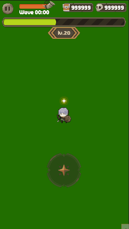

# ProjectMR
## Summary
- https://everyday-devup.tistory.com/category/ProjectMR

## Tech
> 1. Unity 시작 씬은 빈 씬으로 처리 
>> 첫 씬이 무거우면 게임 실행 시 검은 화면을 오래 볼 수 있음
> 2. 씬 로딩 간의 빈 씬 추가 
>> 씬 로드/언로드 사이에 리소스가 모두 올라갈 수 있음.\
>> 가벼운 로딩 씬을 추가함으로써 불필요한 메모리 증가를 막음
> 3. 옵저버 패턴 추가
>> 스크립트 간의 의존성을 줄이기 위해 이벤트 시스템을 추가.\
>> Gamepad를 움직일 경우, EventMessenger에서 GamepadMove 를 구독하는 객체에게 메시지를 보냄
> 4. 싱글톤 추가
>> MonoSingleton과 C# Singleton으로 나누어 Generic으로 구현
> 5. 게임 패드 개선
>> Unity에서 제공하는 On-Screen Stick을 사용할 경우 핸들러를 움직일 수도 있고 \
>> PointDown 위치에서 핸드러를 움직일 수도 있지만, 핸들의 배경은 움직일 수 있는 방안이 없음
>> GamepadArea를 추가하여 PointerDown 위치로 방향패드가 움직이고 핸들도 움직일 수 있도록 추가\
